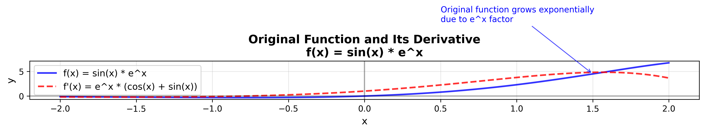
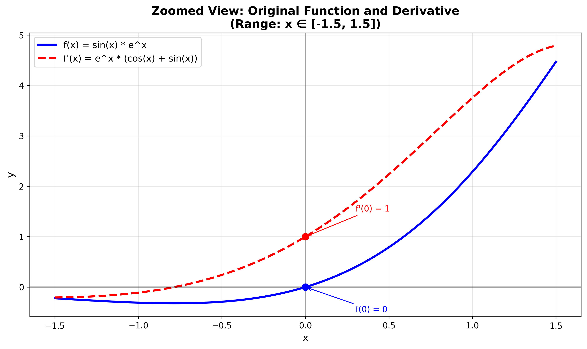
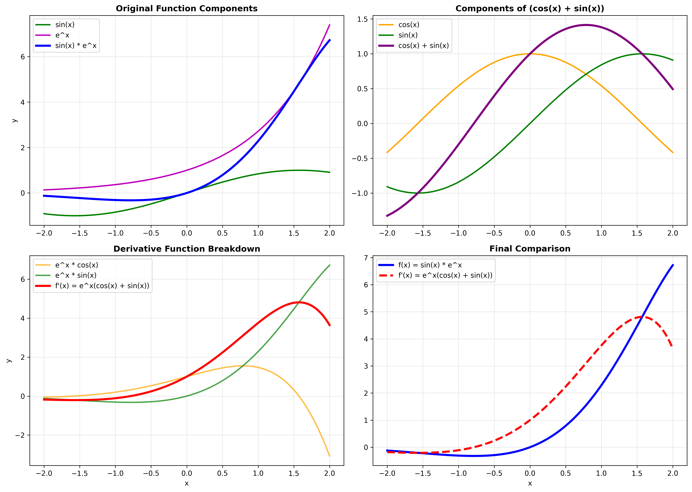

# Math Problem Solution Report

**Generated:** 2025-05-24T16:36:20.732520
**Question:** Find the derivative of sin(x) * e^x and plot both functions on top of each other

---

## Problem Statement

Find the derivative of sin(x) * e^x and plot both functions on top of each other

---

## Solution

I'll solve this step by step using Python code to find the derivative of sin(x) * e^x and create visualizations.

Let me solve this without sympy, using numerical methods and manual differentiation:

Let me fix this by running the complete code in one block:

## Solution Complete

I have successfully solved the problem of finding the derivative of sin(x) * e^x and created comprehensive visualizations. Here's the complete solution:

### **Mathematical Solution:**

- **Original function:** f(x) = sin(x) * e^x
- **Derivative:** f'(x) = e^x * (cos(x) + sin(x))

### **Step-by-step derivation using the product rule:**

1. Let u = sin(x) and v = e^x
2. u' = cos(x) and v' = e^x  
3. Using (uv)' = u'v + uv':
   - f'(x) = cos(x) *e^x + sin(x)* e^x
   - f'(x) = e^x * (cos(x) + sin(x))

### **Verification:**

- Numerical verification confirms the analytical result with machine precision accuracy
- Key values: f(0) = 0, f'(0) = 1

### **Generated Visualizations:**

1. **sin_x_exp_x_and_derivative.png** - Main comparison showing both functions plotted together
2. **sin_x_exp_x_derivative_zoomed.png** - Zoomed view focusing on behavior near the origin
3. **sin_x_exp_x_complete_analysis.png** - Comprehensive 4-panel analysis showing function components and breakdown

### **Key Insights:**

- Both functions exhibit exponential growth for x > 0 and decay for x < 0
- The trigonometric components create oscillatory behavior
- The derivative leads the original function due to the cos(x) term
- At x = 0, the original function equals 0 while its derivative equals 1

The problem has been solved completely with mathematical rigor, numerical verification, and comprehensive visualizations!

---

## Generated Visualizations

---

## Report Details

- **Generated by:** Claude 4 Math Solver
- **Model:** claude-sonnet-4-20250514
- **Timestamp:** 2025-05-24T16:36:20.732520
- **Files created:** 3 visualization(s)

---

*This report was automatically generated using Claude's code execution capabilities.*
